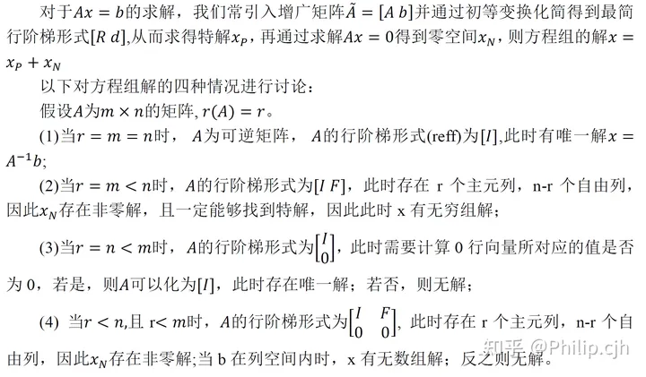
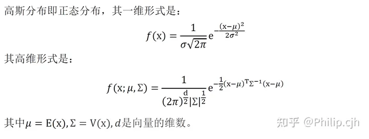

<!--
 * @Author: https://github.com/haohaoalt
 * @Date: 2023-12-13 11:46:04
 * @LastEditors: hayden haohaoalt@163.com
 * @LastEditTime: 2023-12-13 12:01:51
 * @FilePath: /hao_slambook2/ch1/hw1.md
 * @Description: 
 * Copyright (c) 2023 by haohaoalt@163.com, All Rights Reserved. 
-->
# HW1
ref： https://zhuanlan.zhihu.com/p/388386417
## 01 求解Ax = b

## 02 高斯分布

## 03 类与STL
## 04 编程方式
## 05 C++11
## 06 了解linux
## 07 linux
## 08 软件安装及源更新
当只知道模糊的软件名称（如Eigen），可以在终端中输入
```
sudo apt search eigen
sudo apt-cache search Eigen
```
## 09 VIM