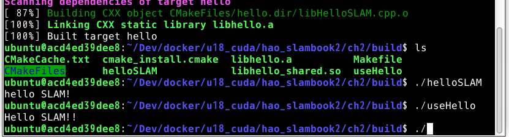

<!--
 * @Author: https://github.com/haohaoalt
 * @Date: 2023-12-13 12:15:04
 * @LastEditors: hayden haohaoalt@163.com
 * @LastEditTime: 2023-12-13 12:17:37
 * @FilePath: /hao_slambook2/ch2/hw2.md
 * @Description: 
 * Copyright (c) 2023 by haohaoalt@163.com, All Rights Reserved. 
-->
# book code

# HW2
## 01 单目视觉及基于图优化SLAM综述
## 02 视觉SLAM综述
## 03 g++
## 04 cmake
## 05 g++报错处理
## 06 链接阶段问题处理
## 07 cmake实践
## 08 find_package
## 09 cmake-tutorial
## 10 KDevelop
## 11 Vim